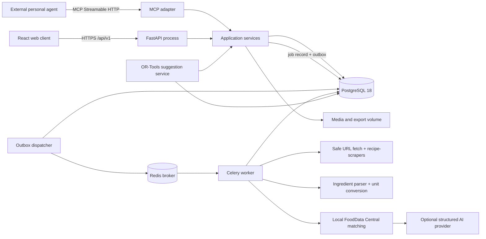

# Implementation Plan: Gym-Focused Recipe & Nutrition Planner

**Branch**: `001-nutrition-recipe-planner` | **Date**: 2026-08-09 | **Spec**: [spec.md](spec.md)
**Input**: Feature specification from `/specs/001-nutrition-recipe-planner/spec.md`

## Summary

Build Vigor & Vine as a fresh, self-hosted nutrition-first web application rather than a fork of
Mealie or Tandoor. Deliver the core P1-P3 loop first: capture a recipe, calculate honest and
correctable per-serving macros, compare planned servings with personal targets, and derive a grocery
list. Use a React single-page client over one versioned FastAPI application API, a PostgreSQL system
of record, and Redis-backed Celery workers for durable imports and nutrition jobs. Reuse
`recipe-scrapers`, `ingredient-parser-nlp`, Pint, USDA FoodData Central, and later OR-Tools; keep
optional LLM assistance behind a schema-validated provider boundary and expose later MCP tools through
the same application services used by the API.

## Technical Context

**Language/Version**: Python 3.13 for server and workers; TypeScript 5.x on Node.js 22 LTS for the web client  
**Primary Dependencies**: FastAPI, Pydantic 2, SQLAlchemy 2, Alembic, psycopg 3, Celery 5.6, Redis, HTTPX, `recipe-scrapers`, `ingredient-parser-nlp`, Pint, OR-Tools 9.15 (P4), MCP Python SDK 2.x (P5), React 19.2, Vite 8.1, React Router, TanStack Query, React Hook Form, Zod, Radix UI primitives  
**Storage**: PostgreSQL 18 for application and locally imported nutrition-reference data; Redis for durable job brokering and short-lived coordination; filesystem/object-compatible media volume for recipe images and export archives  
**Testing**: pytest, pytest-asyncio, Hypothesis, Testcontainers, contract tests against OpenAPI, Vitest, React Testing Library, axe-core, Playwright, and a versioned 20-30 recipe accuracy corpus  
**Target Platform**: Linux containers deployed by Docker Compose; current evergreen desktop and mobile browsers, with 390x844 as the narrow acceptance viewport  
**Project Type**: Self-hosted web application with API and separately scalable worker process  
**Performance Goals**: Interactive reads and plan mutations p95 under 500 ms on reference hardware; visible plan totals within 2 seconds for 50 entries; recipe save/import acknowledgement under 1 second before background processing; feasible weekly suggestions within 10 seconds  
**Constraints**: One owner or small household; no recurring product subscription; no in-app chatbot; all nutrition uncertainty and provenance visible; manual corrections authoritative; optional AI failure cannot block manual workflows; jobs retry-safe and idempotent; secrets stay server-side  
**Scale/Scope**: Initial core P1-P3, followed by P4-P6; up to 10,000 recipes, 50 planned entries per week, one active goal context, one worker by default, and horizontal worker scaling without API changes

## Constitution Check

*GATE: Passed before Phase 0 research and re-checked after Phase 1 design.*

| Gate | Pre-research result | Post-design evidence |
|---|---|---|
| Macro-goal alignment | PASS — scope begins at recipe nutrition and ends at target-aware planning and shopping. | `data-model.md` centers nutrition snapshots, goals, meal entries, and grocery sources; P6 remains expansion scope. |
| Nutrition integrity | PASS — the spec requires provenance, serving basis, visible states, and durable corrections. | Typed estimates, matches, corrections, and snapshots preserve values and provenance; validation corpus and fixtures are explicit. |
| Bounded processing | PASS — parsing/matching are finite jobs and suggestions are deterministic. | `contracts/background-jobs.md` defines idempotency, retries, job states, and input hashes; OR-Tools is isolated to P4. |
| Data ownership and contracts | PASS — self-hosted storage, portable exports, one business-logic layer. | `contracts/openapi.yaml`, `contracts/mcp-tools.md`, and `contracts/export-format.md` share application services and specify degraded states. |
| Reuse and product quality | PASS — a source spike compared both fork candidates and selected maintained dependencies. | `research.md` records adopt/adapt/reject and licensing decisions; `DESIGN.md` is a required UI acceptance input. |
| Verification | PASS — critical calculation, job, contract, and journey tests are mandatory. | The project structure separates unit, integration, contract, end-to-end, accessibility, and accuracy-corpus evidence. |

No constitution exception is required.

## Architecture and Flow



The API and MCP adapter are transport layers only. Both call the same application commands and
queries, so validation, correction precedence, authorization, idempotency, and totals cannot drift.
Workers receive identifiers and stable input hashes, load authoritative state from PostgreSQL, and
commit results only when the input hash still matches.

## Delivery Sequence

1. **Foundation and spike closure**: create the monorepo, owner authentication, database migrations,
   health checks, safe configuration, generated API client, Docker Compose deployment, and license
   inventory. Preserve the completed fork-vs-fresh evidence in `research.md`.
2. **Recipe and nutrition proof (P1)**: manual CRUD, safe URL capture, original ingredient retention,
   deterministic parsing, local reference matching, unit/density conversion, job states, source
   nutrition, estimates, corrections, and reprocessing. Run the 20-30 recipe corpus before proceeding.
3. **Goals and planning (P2)**: goal effective dates, optional meal targets, weekly plan CRUD,
   immutable nutrition snapshots, consistent totals, and desktop/narrow-mobile target visualization.
4. **Grocery loop (P3)**: traceable ingredient scaling, safe aggregation, dirty/current regeneration,
   manual edits and completion-state reconciliation, portable export, and restore validation.
5. **Expansion (P4-P6)**: OR-Tools suggestions and infeasibility explanations; MCP tools and scoped
   tokens; pantry matching, deductions, search, and micronutrients. Each expansion remains separately
   releasable and cannot weaken P1-P3 guarantees.

The P1 accuracy gate blocks major UI-polish work beyond the minimum recipe review/correction flow if
SC-001 or SC-002 fails. Failures must be classified as parse, match, conversion, yield, or reference
data errors before changing thresholds or adding AI assistance.

## Security and Reliability Boundaries

- URL fetching accepts only HTTP/HTTPS, resolves every redirect, blocks loopback/private/link-local/
  metadata addresses, limits response bytes and time, validates content type, and never forwards user
  cookies. `recipe-scrapers` receives already-fetched HTML.
- Owner sessions use HttpOnly, SameSite cookies with CSRF protection; API/MCP tokens are scoped,
  revocable, shown once, and stored as hashes. Passwords use Argon2id.
- PostgreSQL is authoritative for jobs and outbox records. Redis loss may delay processing but cannot
  erase recipes or falsely mark jobs complete. A reconciler republishes unsent or stalled jobs.
- Core nutrition and plan values use decimal/fixed precision. Floating point is allowed only inside
  matching scores and optimization, with scaled integers at solver boundaries.
- Logs contain request/job correlation IDs and structured failure codes, never recipe page bodies,
  provider prompts, tokens, passwords, or personal goal values by default.
- Backups include a consistent database snapshot, manifest, media files, and checksums. Portable JSON
  export is versioned separately from disaster-recovery backup.

## Project Structure

### Documentation (this feature)

```text
specs/001-nutrition-recipe-planner/
├── plan.md
├── research.md
├── data-model.md
├── quickstart.md
├── contracts/
│   ├── openapi.yaml
│   ├── background-jobs.md
│   ├── export-format.md
│   └── mcp-tools.md
├── checklists/
│   └── requirements.md
└── tasks.md                    # Created later by /speckit.tasks
```

### Source Code (repository root)

```text
backend/
├── pyproject.toml
├── migrations/
├── src/vigor_vine/
│   ├── api/                    # HTTP routes, DTOs, auth/session transport
│   ├── application/            # Commands, queries, orchestration, policies
│   ├── domain/                 # Entities, value objects, calculations
│   ├── infrastructure/         # SQL repositories, FDC, media, fetcher, providers
│   ├── jobs/                   # Celery tasks, outbox dispatcher, reconciliation
│   ├── mcp/                    # MCP adapter over application services
│   └── cli/                    # Bootstrap, reference import, backup/restore
└── tests/
    ├── unit/
    ├── integration/
    ├── contract/
    └── fixtures/nutrition-corpus/

frontend/
├── package.json
├── src/
│   ├── app/                    # Router, providers, generated client setup
│   ├── features/               # recipes, goals, plans, grocery, later expansions
│   ├── components/             # Shared accessible UI primitives
│   ├── styles/                 # DESIGN.md tokens, fonts, responsive foundations
│   └── test/
└── e2e/

deploy/
├── docker/
├── compose.yaml
└── backup/

scripts/
├── verify.ps1
└── verify.sh

docs/
├── self-hosting.md
├── backup-restore.md
└── nutrition-methodology.md
```

**Structure Decision**: Use one Python package for API, worker, CLI, and MCP adapters so domain and
application rules remain single-sourced while processes scale independently. Keep the React client in
the same repository with a generated TypeScript client from the committed OpenAPI contract. Deployment
files are isolated under `deploy/`; feature design artifacts remain under `specs/`.

## Complexity Tracking

No constitution violations or approved complexity exceptions are present. PostgreSQL, Redis, and a
separate worker are baseline constitutional architecture, not discretionary services; the outbox and
job record are the minimum mechanism that makes this boundary durable and observable.
