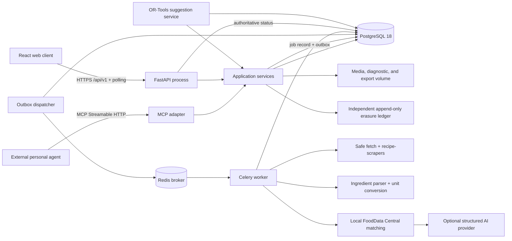

# Implementation Plan: Gym-Focused Recipe & Nutrition Planner

**Branch**: `001-nutrition-recipe-planner` | **Date**: 2026-08-09 | **Spec**: [spec.md](spec.md)
**Input**: Feature specification from `/specs/001-nutrition-recipe-planner/spec.md`

## Summary

Build Vigor & Vine as a fresh, self-hosted nutrition-first web application rather than a fork of
Mealie or Tandoor. Deliver the core P1-P3 loop first: capture a recipe, calculate honest and
correctable per-serving macros, compare planned servings with personal targets, and derive a grocery
list. Use a React single-page client over one versioned FastAPI application API, a PostgreSQL system
of record, and Redis-backed Celery workers for durable imports and nutrition jobs. Reuse
`recipe-scrapers`, `ingredient-parser-nlp`, Pint, USDA FoodData Central, and later OR-Tools; keep
optional LLM assistance behind a schema-validated provider boundary and expose later MCP tools through
the same application services used by the OpenAPI 3.1 contract for API v0.2.0. The clarified design
uses exact decimal-string
contracts, a versioned 50-recipe validation corpus, explicit archive/restore/erasure semantics,
privacy-bounded retention, an independently preserved erasure ledger, explicit reference-dataset
activation, an offline fail-closed full-owner erasure command, a reproducible reference-hardware
profile, deterministic infeasible-suggestion ranking, a fixed P6 micronutrient set, and polling-based
jobs with deterministic retry deadlines.

## Technical Context

**Language/Version**: Python 3.13 for server and workers; TypeScript 5.x on Node.js 22 LTS for the web client  
**Primary Dependencies**: FastAPI, Pydantic 2, SQLAlchemy 2, Alembic, psycopg 3, Celery 5.6, Redis, HTTPX, `recipe-scrapers`, `ingredient-parser-nlp`, Pint, OR-Tools 9.15 (P4), MCP Python SDK 2.x (P5), React 19.2, Vite 8.1, React Router, TanStack Query, React Hook Form, Zod, Radix UI primitives  
**Storage**: PostgreSQL 18 for application and locally imported nutrition-reference data; Redis for job delivery and short-lived coordination while PostgreSQL remains authoritative; filesystem/object-compatible media volume for recipe images, opt-in encrypted failed-import diagnostics, and export archives; append-only erasure-ledger volume that restore cannot overwrite
**Testing**: pytest, pytest-asyncio, Hypothesis, Testcontainers, OpenAPI/MCP/background-job/backup-ledger contract tests, Vitest, React Testing Library, axe-core, Playwright, retention-clock fixtures, and a versioned 50-public-page recipe accuracy/import corpus with a stable 30-recipe constitutional subset
**Target Platform**: Linux containers deployed by Docker Compose; current evergreen desktop and mobile browsers, with 390x844 as the narrow acceptance viewport  
**Project Type**: Self-hosted web application with API and separately scalable worker process  
**Performance Goals**: Interactive reads and plan mutations p95 under 500 ms on the reference profile (Linux x86-64 Docker host, 4 vCPU, 8 GiB RAM, SSD, API/worker/PostgreSQL/Redis colocated); visible plan totals within 2 seconds for 50 entries; recipe save/import acknowledgement under 1 second; visible job-state discovery within 2 seconds on the active job screen; terminal import/nutrition outcome within 15 minutes; feasible weekly suggestions within 10 seconds. Each latency report seeds the documented dataset, performs 10 unmeasured warm-up requests, and reports p50/p95/max for at least 100 measured requests in each of three runs
**Constraints**: One owner or small household; no recurring product subscription; no in-app chatbot; fixed-decimal storage and decimal-string public contracts; deterministic round-half-up display totals; manual corrections authoritative; optional AI failure cannot block manual workflows; jobs retry-safe, idempotent, and bounded to five attempts; raw provider payloads are never retained; secrets stay server-side
**Scale/Scope**: Initial core P1-P3, followed by P4-P6; up to 10,000 recipes, 50 planned entries per week, one active goal context, one worker by default, and horizontal worker scaling without API changes

No `NEEDS CLARIFICATION` items remain.

## Constitution Check

*GATE: Passed before Phase 0 research and re-checked after Phase 1 design.*

| Gate | Pre-research result | Post-design evidence |
|---|---|---|
| Macro-goal alignment | PASS — scope begins at recipe nutrition and ends at target-aware planning and shopping. | `data-model.md` centers nutrition snapshots, goals, meal entries, and grocery sources; P6 remains expansion scope. |
| Nutrition integrity | PASS — provenance, serving basis, visible states, durable corrections, exact decimal rules, and the 50-recipe benchmark are explicit. | Typed estimates, matches, corrections, quantized snapshots, and a stable 30+20 corpus preserve values and reproducible evidence. |
| Bounded processing | PASS — parsing/matching are finite jobs and suggestions are deterministic. | `contracts/background-jobs.md` fixes attempt timeouts, retry delays, five-attempt limits, a 15-minute deadline, idempotency, and stale-input rejection. |
| Data ownership and contracts | PASS — self-hosted storage, portable exports, documented lifecycle/erasure, one business-logic layer. | `contracts/openapi.yaml`, `contracts/mcp-tools.md`, and `contracts/export-format.md` cover recipe restore/erasure, an independent erasure-ledger restore gate, grocery manual CRUD, access tokens, suggestions, exact decimals, and degraded states. |
| Reuse and product quality | PASS — a source spike compared both fork candidates and selected maintained dependencies. | `research.md` records adopt/adapt/reject and licensing decisions; `DESIGN.md` is a required UI acceptance input. |
| Verification | PASS — critical calculation, lifecycle, retention, job, contract, and journey tests are mandatory. | The project structure separates unit, integration, contract, end-to-end, accessibility, retention, provider-outage, owner-erasure, performance, and 50-recipe corpus evidence. |

No constitution exception is required.

## Architecture and Flow



The API and MCP adapter are transport layers only. Both call the same application commands and
queries, so validation, correction precedence, exact decimal serialization, authorization,
idempotency, and totals cannot drift. Workers receive identifiers and stable input hashes, load
authoritative state from PostgreSQL, and commit results only when the input hash still matches. The UI
polls that authoritative job record every two seconds on visible job screens and every 15 seconds
elsewhere; it does not depend on Celery result state.

## Delivery Sequence

1. **Foundation and decision propagation**: create the monorepo, owner authentication, database
   migrations, health checks, safe configuration, generated API client, Docker Compose deployment,
   license inventory, decimal-string type adapters, retention clock, and the complete canonical API.
2. **Recipe and nutrition proof (P1)**: manual CRUD, archive/restore/confirmed erasure, safe URL capture,
   original ingredient retention, deterministic parsing, local reference matching, unit/density
   conversion, bounded job states, source nutrition, estimates, corrections, reprocessing, and
   explicit Foundation Foods/SR Legacy release activation with a no-dataset degraded state. Run all
   50 captured public-page cases and report the stable 30-recipe primary subset separately. Assemble
   the corpus and pass the 30-recipe constitutional accuracy gate after the minimum review/correction
   flow but before the searchable library, polished editor, or recipe-detail UI is implemented.
3. **Goals and planning (P2)**: goal effective dates, optional meal targets, weekly plan CRUD,
   immutable display-quantized nutrition snapshots, exact decimal-string totals, and desktop/narrow-
   mobile target visualization.
4. **Grocery loop (P3)**: traceable ingredient scaling, safe aggregation, dirty/current regeneration,
   manual item create/update/delete and completion reconciliation, portable export, independent
   erasure-ledger persistence, replay-gated restore, and restore validation.
5. **Expansion (P4-P6)**: complete suggestion create/status/result/preview/partial-accept contracts;
   access-token HTTP routes and MCP plan reads/writes; pantry matching, deductions, search, and
   micronutrients. Each expansion remains separately releasable and cannot weaken P1-P3 guarantees.

The P1 accuracy gate blocks the searchable library, polished editor, recipe-detail UI, and all later
stories until the stable 30-recipe subset passes SC-001 and SC-002. Only the minimum review/correction
harness needed to inspect benchmark failures may precede the gate. Failures must be classified as
parse, match, conversion, yield, reference-data, or benchmark-eligibility errors before changing
thresholds or adding AI assistance. The full 50-recipe report remains required for the P1 checkpoint.

## Numeric and Benchmark Rules

- Store nutrient values and ingredient quantities at six fractional decimal places and servings at
  three. Public API, MCP, job-result, and export decimals are canonical strings.
- Use round-half-up. Quantize plan-entry calories to 1 kcal and macros to 0.1 g before aggregation;
  displayed totals and target differences sum those same values exactly.
- The versioned benchmark has 15 simple, 20 moderate, and 15 complex recipes across cuisines, dietary
  patterns, units, sites, ambiguous foods, and conversion risks. All 50 are captured public-page
  import cases. The 30-recipe primary subset satisfies the constitutional gate and the full 50
  controls the product success criteria.
- A complete result has non-null calories, protein, carbohydrate, and fat with at least 90% ingredient
  coverage. Coverage is the lower of (a) matched mass divided by total quantified non-optional mass and
  (b) resolved non-optional ingredient count divided by total non-optional ingredient count; a missing
  denominator yields zero. Median absolute percentage error gates are 20% for calories and 25% for
  protein, carbohydrates, and fat. Near-zero floors and absolute-error reporting follow SC-002 exactly.
- The P6 micronutrient keys are `dietary_fiber_g`, `sodium_mg`, `potassium_mg`, `calcium_mg`,
  `iron_mg`, `magnesium_mg`, `vitamin_d_ug`, `vitamin_b12_ug`, and `vitamin_c_mg`. A versioned mapping
  manifest binds them to canonical USDA nutrient identifiers for each imported release. Missing or
  insufficiently covered values remain null; zero is stored only when the source value is truly zero.

## Suggestion Ranking Rules

- Recipe exclusions, positive serving bounds, and active-recipe availability are inviolable hard
  constraints. A candidate violating any of them is never returned as an alternative.
- Feasible runs satisfy every selected tolerance and required/repetition constraint. When none exists,
  rank alternatives lexicographically by: fewest other unmet constraints; lowest normalized weighted
  distance; fewest entries; then the ordered recipe UUID tuple.
- Normalize each calorie/macro deviation by its positive selected tolerance, using a denominator of one
  display unit when a tolerance is zero. The weighted distance is `4*calorie + 3*protein +
  1*carbohydrate + 1*fat + 2*repetition_overage + 5*missing_required_recipe_count`. Persist the score,
  component deviations, and missed constraints so UI, API, MCP, and fixtures explain the same result.

## Security, Lifecycle, and Reliability Boundaries

- URL fetching accepts only HTTP/HTTPS, resolves every redirect, blocks loopback/private/link-local/
  metadata addresses, limits response bytes and time, validates content type, and never forwards user
  cookies. `recipe-scrapers` receives already-fetched HTML.
- Successful-import HTML is discarded after extraction. Failed-import HTML is encrypted and retained
  for at most 24 hours only with owner-enabled diagnostics. Raw provider requests/responses are never
  retained. Detailed job diagnostics reduce after 30 days; safe codes/timestamps expire after one year.
- Foundation Foods and SR Legacy are required active P1 datasets. Operators explicitly inspect,
  import, and activate versioned releases on a documented 90-day review cadence; activation never
  rewrites estimates, and missing datasets leave manual/source nutrition usable.
- Archive is reversible and excludes a recipe from active search, planning, and suggestions. Restore
  returns the prior usable state or `stale`. Confirmed permanent deletion is allowed only from archive,
  cancels/supersedes jobs, removes recipe-owned records, and preserves detached historical snapshots
  and grocery source text.
- Owner sessions use HttpOnly, SameSite cookies with CSRF protection; API/MCP tokens are scoped,
  revocable, shown once, and stored as hashes. Passwords use Argon2id.
- PostgreSQL is authoritative for jobs and outbox records. Redis loss may delay processing but cannot
  erase recipes or falsely mark jobs complete. A reconciler republishes unsent or stalled jobs.
- Each attempt times out after 60 seconds. Retries wait 5 seconds, 30 seconds, 2 minutes, and 5 minutes;
  at most five attempts and a 15-minute initial-acceptance deadline are permitted.
- Backups include a consistent database snapshot, manifest, media files, checksums, and the current
  erasure-ledger cursor. The content-free hash-chained ledger lives on a separately preserved volume,
  is replicated with the backup set but never overwritten by restore, and gates activation until every
  post-backup erasure is replayed. Records remain through backup rotation plus 30 days. Portable JSON
  export is versioned separately.
- Full owner erasure is an offline operator action, not an HTTP/MCP mutation. The CLI acquires an
  instance-wide maintenance lock, verifies API/worker/outbox processes are stopped, requires the owner
  UUID plus exact `ERASE OWNER <uuid>` confirmation, verifies an appendable independent ledger, stages
  managed files into same-volume quarantine, appends one `owner_owned` record, applies the idempotent
  owner-scope database deletion, and then removes quarantine after verification. Failed preflight or
  ledger append restores quarantine and leaves live state unchanged. A database/file failure after the
  ledger append keeps services in maintenance mode and is resumed idempotently from the durable ledger
  record; activation is forbidden until database, managed-file, and bootstrap-state verification pass.
- Estimated nutrition and suggestion decision surfaces display concise planning-aid—not-medical-advice
  copy with provenance and correction controls. API v0.2.0, MCP, and export documentation carry the
  same limitation.
- Provider-disabled, timeout, invalid-output, and failure substitutes must leave deterministic results
  or explicit partial/failed nutrition states while manual recipes, nutrition, goals, plans, groceries,
  backups, and exports remain operational. Cross-workflow fixtures prove SC-015 before release.

## Project Structure

### Documentation (this feature)

```text
specs/001-nutrition-recipe-planner/
├── plan.md
├── research.md
├── data-model.md
├── quickstart.md
├── contracts/
│   ├── openapi.yaml
│   ├── background-jobs.md
│   ├── export-format.md
│   └── mcp-tools.md
├── checklists/
│   ├── nutrition.md
│   └── requirements.md
└── tasks.md
```

### Source Code (repository root)

```text
backend/
├── pyproject.toml
├── migrations/
├── src/vigor_vine/
│   ├── api/                    # HTTP routes, exact-decimal DTOs, auth/session transport
│   ├── application/            # Commands, queries, orchestration, policies, owner erasure
│   ├── domain/                 # Entities, fixed decimals, calculations, lifecycle
│   ├── infrastructure/         # SQL repositories, FDC, media, retention, fetcher, providers
│   ├── jobs/                   # Celery tasks, outbox dispatcher, reconciliation
│   ├── mcp/                    # MCP adapter over application services
│   └── cli/                    # Bootstrap, reference import, backup/restore, owner erasure
└── tests/
    ├── unit/
    ├── integration/
    ├── contract/
    ├── performance/
    └── fixtures/nutrition-corpus/

frontend/
├── package.json
├── src/
│   ├── app/                    # Router, providers, generated client setup
│   ├── features/               # recipes, goals, plans, grocery, later expansions
│   ├── components/             # Shared accessible UI primitives
│   ├── styles/                 # DESIGN.md tokens, fonts, responsive foundations
│   └── test/
└── e2e/

deploy/
├── docker/
├── compose.yaml
└── backup/

scripts/
├── verify.ps1
└── verify.sh

docs/
├── self-hosting.md
├── backup-restore.md
├── operations-runbook.md
└── nutrition-methodology.md
```

**Structure Decision**: Use one Python package for API, worker, CLI, and MCP adapters so domain and
application rules remain single-sourced while processes scale independently. Keep the React client in
the same repository with a generated TypeScript client from the committed OpenAPI contract. Deployment
files are isolated under `deploy/`; feature design artifacts remain under `specs/`.

## Complexity Tracking

No constitution violations or approved complexity exceptions are present. PostgreSQL, Redis, and a
separate worker are baseline constitutional architecture, not discretionary services; the outbox and
job record are the minimum mechanism that makes this boundary durable and observable. Exact decimal
DTOs, bounded retention, and polling reuse the existing boundaries rather than add services.
