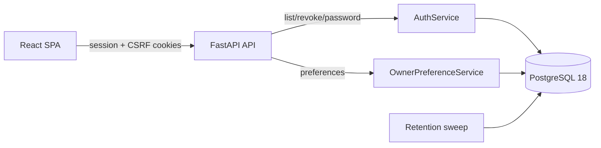

# Implementation Plan: Persistent Sessions & Account Security Settings

**Branch**: `002-persistent-sessions-settings` | **Date**: 2026-08-12 | **Spec**: [spec.md](spec.md)
**Input**: Feature specification from `/specs/002-persistent-sessions-settings/spec.md`

## Summary

Extend the existing opaque, server-side session model (SHA-256-hashed token in PostgreSQL, HttpOnly
cookie) from a 14-day hard expiry to an Immich-style ~400-day persistent session, valid until explicit
revocation, and add the account/security surface that long-lived sessions require. A single tabbed
Settings page (Account, Security, API access) becomes the home for editing profile preferences, listing
and revoking active sessions, changing the password, and managing agent access tokens. No new
dependencies or technology are introduced: the change is a TTL configuration, a session surrogate
identifier, three new owner-only endpoints, a small retention sweep, and a frontend settings page plus
global session-expiry handling.

## Technical Context

**Language/Version**: Python 3.13 (backend), TypeScript 5.x on Node.js 22 LTS (frontend)
**Primary Dependencies**: FastAPI, Pydantic 2, SQLAlchemy 2, Alembic, psycopg 3, Argon2, React 19.2, Vite 8.1, React Router, TanStack Query, Radix UI primitives
**Storage**: PostgreSQL 18 (`sessions`, `owner_accounts` tables); no new stores
**Testing**: pytest (integration: auth/session/retention), Vitest + React Testing Library (settings page, session list, 401 handling), Playwright (mocked session-probe e2e)
**Target Platform**: Linux containers via Docker Compose; evergreen desktop + 390x844 mobile viewport
**Project Type**: Self-hosted web application (FastAPI API + React SPA)
**Performance Goals**: Session list and settings reads remain p95 < 500 ms on the reference profile; session validation adds no measurable overhead beyond the existing `last_seen_at` write
**Constraints**: Single owner or small household; secrets stay server-side (Principle IV); no new AI/background jobs beyond the idempotent retention sweep; browser cookie lifetime is capped at 400 days
**Scale/Scope**: One owner, a handful of active sessions per owner, and a small bounded session table

No `NEEDS CLARIFICATION` items remain.

## Constitution Check

*GATE: Passed before Phase 0 research and re-checked after Phase 1 design.*

| Gate | Pre-research result | Post-design evidence |
|---|---|---|
| Macro-goal alignment | PASS — removes repeated sign-in friction from the plan/cook/eat workflow; adds no archive/social/lifestyle capability. | `data-model.md` and the settings page IA touch only identity/session state, never recipe/plan/nutrition data. |
| Nutrition integrity | PASS — no nutrition value, provenance, serving basis, or correction path is affected. | No nutrition model, service, or contract is modified; the settings page is orthogonal to estimation. |
| Bounded processing | PASS — the only background work is an idempotent sweep deleting expired/revoked session rows. | `data-model.md` and the sweep contract fix a bounded 30-day grace period; no AI, no cache, no job queue. |
| Data ownership and contracts | PASS — owner-only endpoints under the existing browser-session gate; secrets remain server-side. | `contracts/account-session-api.md` defines sessions list/revoke, password change, and preferences additions; no MCP change; sessions remain PostgreSQL-authoritative and thus backup/export-inclusive. |
| Reuse and product quality | PASS — adopts Immich's persistent-session and session-list model; comparison recorded in `docs/inspiration-review.md`. | `research.md` records adopt/adapt/reject; `DESIGN.md` tokens and loading/empty/error states are mandatory for the new page. |
| Verification | PASS — integration tests for TTL, list/revoke, password change, and sweep; unit tests for the settings UI and 401 handling. | Project structure maps each test layer to the changed modules. |

No constitution exception is required.

## Architecture and Flow



The change is confined to the identity boundary. `POST /auth/session` issues a session with a
configurable lifetime (default 400 days) and a `SameSite=lax` cookie; the cookie expiry already mirrors
the session `expires_at`. Three new owner-only endpoints list, revoke, and support password change.
`OwnerPreferenceService` gains `display_name`. The retention sweep deletes stale session rows. The SPA
gains a tabbed Settings page and a global 401 handler that returns an expired/revoked owner to sign-in.

## Project Structure

### Documentation (this feature)

```text
specs/002-persistent-sessions-settings/
├── plan.md              # This file
├── research.md          # Phase 0 output
├── data-model.md        # Phase 1 output
├── quickstart.md        # Phase 1 output
├── contracts/
│   └── account-session-api.md   # Phase 1 output
├── checklists/
│   └── requirements.md
└── spec.md
```

### Source Code (repository root)

```text
backend/
├── src/cookfully/
│   ├── infrastructure/
│   │   ├── config.py                 # add session_ttl_days
│   │   └── models/identity.py        # add SessionRecord.id surrogate key
│   ├── application/
│   │   ├── auth.py                   # TTL wiring, list/revoke/password, client_label
│   │   └── owner_preferences.py      # display_name update
│   ├── api/
│   │   ├── main.py                   # AuthService(session_ttl=...)
│   │   ├── dependencies/auth.py      # require_browser_session
│   │   └── routes/auth.py            # sessions list/revoke, password, SameSite=lax
│   └── jobs/retention.py             # session sweep
├── migrations/versions/              # new migration: sessions.id surrogate + unique id_hash
└── tests/
    ├── integration/test_auth.py      # TTL, list/revoke, password change, sweep
    └── contract/test_*.py            # OpenAPI contract for new endpoints

frontend/
├── src/
│   ├── app/App.tsx                   # Settings route + nav; relocate agent-access
│   ├── app/providers.tsx             # unchanged probe
│   ├── features/settings/
│   │   ├── SettingsPage.tsx          # tabbed shell
│   │   ├── AccountTab.tsx            # display name, timezone, week start
│   │   ├── SecurityTab.tsx           # sessions list/revoke, password, sign out
│   │   └── AgentAccessPage.tsx       # relocated (unchanged logic)
│   └── features/recipes/api.ts       # global 401 handling hook
└── src/features/goals/GoalSettingsPage.tsx  # drop calendar-preference disclosure
```

**Structure Decision**: Follow the existing backend application/route layering and the
`frontend/src/features/<area>/` convention. The new `features/settings/` area hosts the Settings page
and its tabs; the existing `AgentAccessPage` moves under it.

## Delivery Sequence

1. **Session lifetime and identity** — add `session_ttl_days` config, wire `AuthService`, add the
   `SessionRecord.id` surrogate key (migration), populate `client_label` from the User-Agent on login,
   and switch the session/CSRF cookies to `SameSite=lax`.
2. **Session and account endpoints** — list/revoke endpoints, password change, and `display_name` in
   owner preferences, each with integration and contract tests.
3. **Settings page** — tabbed Settings route (Account, Security, API access), relocate Agent Access,
   remove the duplicated calendar-preference disclosure from the goal editor, and add a sign-out
   control plus a global 401-to-sign-in handler.
4. **Retention and polish** — session sweep in the retention job, accessibility/empty/error states at
   desktop and narrow mobile widths, and documentation updates (`docs/inspiration-review.md` is already
   recorded; update `AGENTS.md` Recent Changes and `.env.example`).

## Complexity Tracking

None — no constitution gate is violated and no new complexity is introduced.
